# Module2: The Data Engineering Ecosystem

## The Ecosystem and Languages for Data Professionals
### Overview of the Data Engineering Ecosystem

#### Data Engineering Ecosystem: Definition
A Data Engineering Ecosystem includes tools, infrastructures, software, frameworks and processes needed for Data Engineering.

It includes data structures, data sources, data repositories

#### Data Structures

[Go to this GitHub repository](https://github.com/Starias22/IBM-Data-Analysis-Professional-Certificate/blob/main/Course1/Module2/summary.md)

#### Data Sources

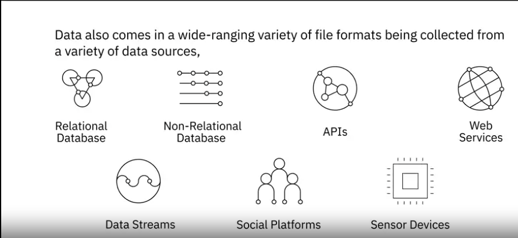

#### Data repositories

There are two types of data repositories: Transactionl and Analytic

##### Transactional

Also know as OLTP system which means Online Transaction Processing system, Transactional data repositories are designed for daily business operations.

- Handle online transactions: insert, update, delete operations
- Optimized for processing
- They are typically relational, but can be non-relational

###### Examples of OLTP systems
- Banking systems
- Reservation systems

##### Analytic

Also know as OLAP system which means Online Analytic Processing System, Transactional data repositories are designed for complex data analytics.

- Optimized for data analytics
- Include relational and non-relational databases, data warehouses, data marts, data lakes and big data stores.

#### Data Integration

Once data have been collected, they need to be processed, cleansed and integrated to be available for final users, which can query and manipulate the data.

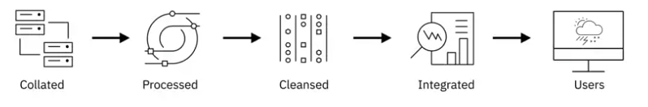

#### Data Pipeline

The journey of data from one source to another
It includes processes such as Extract Transform Load(ETL) and Extract Load Transform(ELT)

#### Languages
- Query languages
    - For querying and manipulating data
    - Ex: SQL
- Programming languages
    - For developing data applications
    - Ex: Python
- Shell and scripting languages
    - For repetitive operational tasks

#### Business Intelligence and Reporting tools 
- Used 
    - to collect data data from multiple sources and present them in a visual format, such as interactive dashbords
    - to visualize data in real time ad pre-defined schedule
    - to drag and drop products; that do not require programming

### Data Types

Data can be categorized by their structures

[Go to this GitHub repository](https://github.com/Starias22/IBM-Data-Analysis-Professional-Certificate/blob/main/Course1/Module2/summary.md)

### Different Types of File Formats

[Go to this GitHub repository](https://github.com/Starias22/IBM-Data-Analysis-Professional-Certificate/blob/main/Course1/Module2/summary.md)

### Sources of Data

- Databases
- Flat files and XML datasets
- APIs and web services
- Web scraping
- Data streams and feeds

[Go to this GitHub repository](https://github.com/Starias22/IBM-Data-Analysis-Professional-Certificate/blob/main/Course1/Module2/summary.md)

### Languages for Data Professionals

- Query languages
    - Acess and manipulate data in databases
    - SQL
- Programming languages
    - Develop data applications
    - Python, R, Java
- Shell and scripting languages
    - For repetitive and time-consuming operational tasks
    - Unix/Linux shell, PowerShell

## Data Repositories, Data Pipelines and Data Integration Platforms

### Overview of Data Repositories

A data repository is an archive or library of data that has been collected, organized and isolated for use in business operations and analyics. It can be one database or a set of databases

Types of data repositories include
- Databases: Collection of data for storage, retrieval and modification
    - Relational datbases
    - Non-relational databases
- Data warehouses: A central data repository that merges informations for different data sources and consolidates them through ETL process
- Big Data Stores: A distributed computational and storage infrastructure designed to store, scale and process very large amount of data

### RDBMs and NoSQL

[Go to this GitHub repository](https://github.com/Starias22/IBM-Data-Analysis-Professional-Certificate/blob/main/Course1/Module2/summary.md)

### Data warehouses, Data Mats and Data Lakes

#### Data warehouses

- A central data repository that merges data from different sources via ETL process
- Store curent and historical data that has been cleansed, conformed and categorized

- Data loaded into data warehouses are anlytics-ready meaning that they are modeled and structured for a specific purpose.

- Store data from
    - Relation databases
    - Non-relational databases

- has a three tier/layer architecture

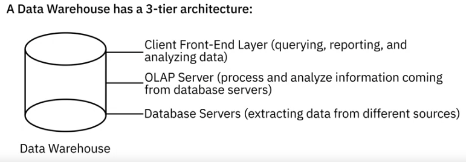

- Benefits of cloud-based data warehouses

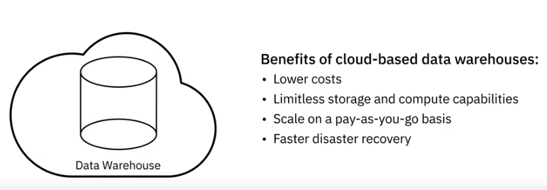

- Examples of cloud-based data warehouses

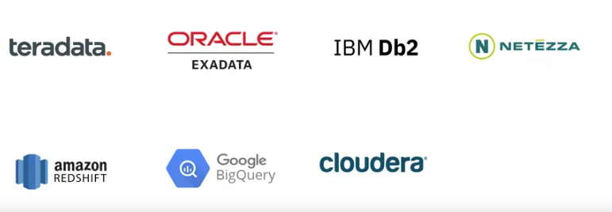

#### Data Mart 

- A subset of a data warehouse, designed for a specific busines perpose, function or community of users
- There are three types of data marts
    - Dependant: A sub-section of an entreprise datawarehouse
    - Independant: Created from other sources other than ean ntreprise datawarehouse such as internal operational system and external data
    - Hybrid: Combine inputs from data warehouses, internal operational systems and external systems

#### Data Lake

A data repository that can store large amount of structured, semi-structured and unstructured data
    - Its a raw data purpose data repository
    - While data stored into data warehouse are aleady ready for use, data lake store data in their native format

## Viewpoints: Considerations for Choice of Data Repository

- Type: structured, semi-structured or unstructured
- Schema
- Performance requirements
- Working with data at rest or streaming data(data in motion)
- Data encryption needed or not
- Volume of the data
- Storage requirements
- Frequency of data acess
- The standards sets by your entreprise on which data repositories allowed to be used
- Purpose
    - Transactional
    - Analytical
    - Archival
    - Data warehousing
- Security features of the data repository
- Scalability for a long-time perspective
- Costs

## ETL, ELT and Data Pipelines

### ETL
- Extract, Transform, Load
- At the heart of gaining value from data
- Convert raw data into analysis-ready data
- Automated system which incles
    - Gathering raw data
    - Extracting informations needed for reporting and analysis. It can be through
        - Batch processing:
            - large chuncks of data moved from source to destination at scheduled intervals
            - Tools: Stitch, BlendO
        - Stream processing:
            - In realtime
            - Tools: Apache Kafka, Apache Samza, Apache Storm

    - Cleaning, standarzing and transforming the data into a usable format
        - For examples:
            - Standardizing date formats and units of measurement
            - Removing duplicates
            - Filtering out that that is not required
            - Splitting names into firstname and lastname
            - Establish key relationship accross tables
            - Apply business rules and data validations

    - Load the data into a data repository
        - It can be
            - Initial loading: Loading all the data
            - Incremental loading: Applying updates
            - Full refresh: erasing a data table and reloading fresh data
        - Load verification includes checks for:
            - Mising or null values
            - Server performance
            - LOad failure

- ETL tools

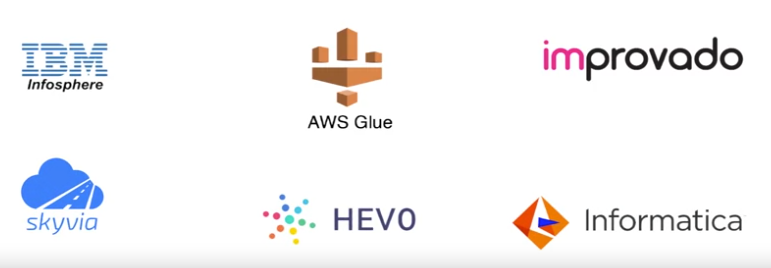

### ELT
- Extract, Transform, Load
- A variation of the ETL process
- The extracted data is first loaded into the target system in it's native format
-  The transformations are applied in the target system
- Destination system:
    - Often Data lake
    - But may also be data warehouse

### Data Pipelines

- The entire journey of moving data from a source to a destination
- Includes ETL procces

### Data Integration Platforms

#### Definition
Data Integration:
- is the process of combining data from different sources into a single, unified view
- involves consolidating data residing in various locations, formats, and structures to provide a comprehensive and coherent dataset for analysis, reporting, and decision-making. 

#### Tools

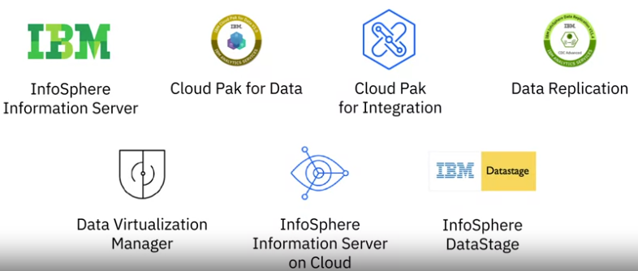

- Talend
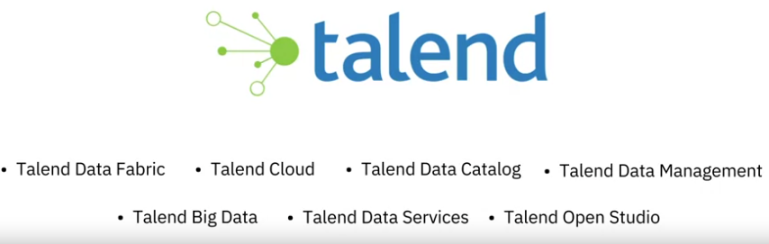

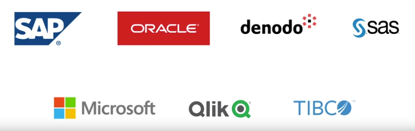

- Open source tools
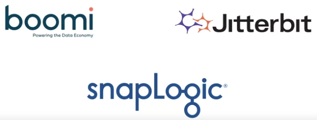

## Big Data Platforms and Big Data Processing Tools

[Go to this GitHub repository](https://github.com/Starias22/IBM-Data-Analysis-Professional-Certificate/blob/main/Course1/Module2/summary.md)

### Hive
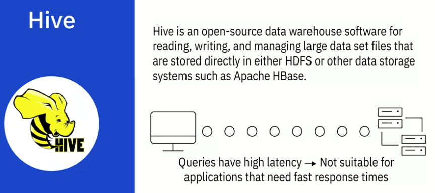

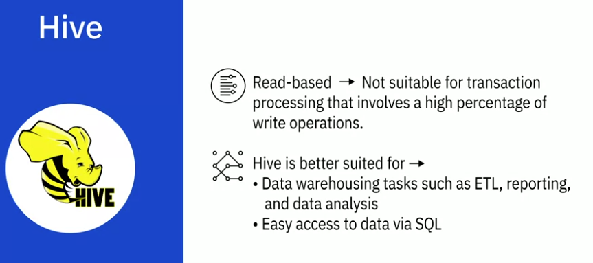