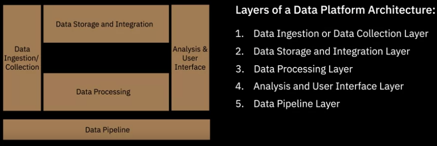

# Module 3: Data Engineering Lifecycle

## Data Platforms, Data Stores and Security

### Architecting the Data Platform

1. Data Collection/Ingestion layer

- Connect to the source systems and bring the data from source systems to the data platform
- Key tasks:
    - Connect to data sources
    - Transfer the data from data sources to the data platform using batch mode, streaming mode or both
    - Maintain informations about the data collected in the metadata repository
- Tools: 

2. Data Storage and Integration layer
- Store the data 
- Transform and merge extracted data
- Make the data available for processing in both batch and streaming mode
- This layer needs to be:
    - Reliable
    - Scalable
    - High performing
    - Cost-efficient
- Tools: 
    - Relational databases
    - Non Relational databases
    - Cloud-based databases also called databas as service
    - Data Integration tools:
        - Paid: 
        - Open Source: boomi, SnapLogic
        - Cloud baded integration tools:  
3. Data Processing Layer
- Reads data in batch or streaming modes and apply transformations
- Transformation tasks
    - Structuration
        - Ordering fields
        - Combining fields
    - Normalization:
        - Remove unsued data
        - Reduce redundancy and inconsistency
    - Denormalization: Combining data from multiple tables to a single table for query efficience
    - Data Cleaning
- Transformation tools: 
- Features
    - Support popular querying tools and programming language
    - Scalable
    - Provide a way to data analyst and scientist to work with the data platform

- Storage and Processing may not be performed in seperate layers
    - Storage and Processing can occur in the same layer.

    - Data can first be stored in Hadoop File Distribution System, or HDFS, and then processed in a data processing engine like Spark.

- Data Processing layer can also precede the Data Storage layer, where transformations are applied before the data is loaded, or stored, in the database.

4. Data Analysis and UI Layer
- Delivers processed data to data consumers which include
    - Data Scientits
    - Data Analysts
    - Business Intelligence Analysts
    - Business stackholders
    - APIs
    - Data applications

 5. Data Pipeline Layer

- Overlays the following layers:
    - Data Ingestion Layer
    - Data Storage and Integration Layer
    - Data Processing Layer
- Implements and maintain a continously flowing data pipeline
- Tools: Apache Airflow, Data Flow

### Factors for Selecting and Designing Data Stores

Data Store= Data Repository

#### Considerations when choosing a data repository

- Type of the data: structured, semi-structured or unstructured
- Volume of data  
- Intended use of data
    - Number of transactions
    - Requency of update
    - Type of operations
    - Responce Time
    - Backup and Recovery

- Storage considerations:
    - Performance(Throuput and Latency)
        - Throuput: Read and Write rate: in MB/s for ex
        - Latency: Acess time: in ms for ex
    - Availability: The data must be acessed when needed without exception
    - Integrity: The data must be safe from error, loss and outside attack
    - Recoverability: The data can be recovered in case of failure and natural disasters

- Privacy, Security and Governance

### Security

Entreprise Data platforms and repositories need to tackle security at multiple levels

#### The CIA Triad

Its identifies the three key components for creating an effective strategy for information security. These components include:
1. Confidentiality: Controlling unauthorized acess
2. Integrity: Making the information safe from erro, loss and outside attack
3. Availability: Ensuring the information can be accessed whenever it is needed

#### Facets or Levels of Security
1. Infrastructure security
2. Network security
    - Firewalls
    - Network acess control
    - Network segmentation
    - Security Protocols
    - Intrusion Detection and Prevention
3. Applicatiion Security:
    - Keep customers data private
    - Ensure applications are fast and responsive
4. Data Security

- Data is either:
    - at rest in storage, or
    - in motion ie in transit between systems, applications, services
- Authentication/Authorization acess on data
    - Authentication: You are who you say you are
        - Passwords
        - Tokens
        - Biometrics
        - A comination of these
    -  Authorization: Users acess informations based on roles and privileges assigned to their roles

- Data at rest:
    - Includes files, objects and storage
    - Stored physically in:
        - Databases
        - Data warehouses
        - Tapes
        - Offsite backups
        - Mobile devices
    - Can be protected by encryption

- Data in motion/in transit:
    - In movment from a source to a destination over the internet
   
    - Can be protected using encryption methods such as:
        - HTTPS
        -  SSL
        - TLS

5. Monitoring and Intelligence:
    1. Monitor
    2. React
    3. Track

### Viewpoints: Importance of Data Security
- Least acess to users
- Data is a natural resource these days

## Data Colection and Data Wrangling

### How to Gather and Import Data?

- Gathering data
    - SQL as a query language for extracting data from relational databases
    - APIs(Application Programming Interfaces)
    - Web scraping aka screen scraping or web harvesting: Download data from web pages. These data include:
        - text
        - contact information
        - images
        - videos
        - podcasts
    - Sensor data: Gather
        - instruments data
        - IoT devices data
        - Applications data
        - GPS data from car
    - Data exchanges platforms: 
        - exchange of data between data provider and data consumers
        - Examples: AWS Data Exchange, Crunchbase, Snowflake, Lotame
    - Other sources:
        - Research and advisor firms
        - Agencies for
            - mobile and web usage
            - market surveys
            - demographic studies
            - user behaviour data
- The gathered data can then be loaded to a specific data repository depending of the type of the data, which cab be structured, semi structured or unstructured

### Data Wrangling
- aka Data Munging
- consist to make the data analytics-ready
- It envolves
    - Data exploration
    - Data transformation
    - Data validation
    - Making the data available for analysis

### Tools for Data Wrangling

- Excel Power Query / Spreadsheets
- OpenRefine
- Google DataPrep
- Watson Studio Refinery
- Trifacta Wrangler
- Python
- R

## Querying data, Performance Tuning, and Troubleshooting

### Querying and Analyzing Data

### Performance Tuning and Troubleshooting

- One of the key responsabilities of a Data Engineer: Monitoring system and data flow for performance and availability
- Performance areas
    - Data Pipelines p
        - Performce threats:
            - Scalability in face of the increasing datasets and workloads
            - Application failures
            - Scheduled jobs not working accuretly
            - Tools incompatibilities
        - Performance metrics
            - Latency: response time of a service
            - Failures: The rates at which a service fails
            - Resource usage
            - Traffic: Number of user requests received in agiven period
        - Troubleshooting
            - Generally, the steps to take:
                1. Collect information about the incident to ensure it is an issue
                2. Check if you are working with the right versions of software and source codes
                3. Check logs and metrics to isolate wether the isue is related to:
                    - infrastructure
                    - data
                    - software
                    - a combination of these
                4. Reproduce the issue in a test environment

#### Database Optimization for Performance
- Performance metrics to be monitored in a database:
    - system outages
    - capacity utilization
    - application slowdown
    - performance of queries
    - conflicting activities and queries being executed simustaneously
    - batch activities causing resource constrainsts
- Best practice for Database Optimization
    - Capacity planning: Determing the optimal hardware and software required for performance
    - Database indexing: Locating data without searching each row in a database, resluting in faster querying
    - Database partitionning: Dividing large tables into smaller, individual tabes
    - Data Normalization: Minimize data redundancies and anomalies
- Monitoring systems: 
    - Help to collect quantitative data about our systems and applications in real time
    - Examples:
        - Database Monitoring Tools: Take frequent snapshot of the performance indicators of the database
        - Application Performance Management Tools: Measure and monitor the performance of applications and the amount of resources used by each process
        - Tools for Monitoring Query Performanc: Gather statistics about throughput, execution, performance, resource usage and usage patterns
        - Job-level Runtime Monitoring: breasks up jobs into a series of logical steps which are monitored for completion and time to completion
        - Monitoring Amount of Data Being Processed through a data pipeline
- Maintainance Schedules
    - Time-based: Planned as scheduled activities at pre-fixed intervals
    - Condition-based: Performed in case of a specific issue or decrease in performance

## Governance and Compliance

### Data Governance

- A collection of 
    - Principles
    - Practices
    - Processes
- To maintain the:
    - Security
    - Privacy
    - Inegrity
- Data that needs governance:
    - Personal
        - Personal Information
        - Personal Sensitive Information

- Data regulations      
    - General Data Protection Regulation(GDPR):
        - A regulation specific to the Eropean union
        - Protects personal data and privacy of EU citizen for transactions that occur within EU member states
    - In US, individual states have formulated their own regulations
        - California Consumer Privacy Act, or CCPA for ex in California to better protect consumers data
    - Industry specific regulations:
        - Examples:
            - In Healthcare: HIPAA privacy rules govern the collection and disclosure of protected health information

            - In Retail: the PCI DSS standards govern credit card data.
            - In Finance: SOX regulations govern the handling and reporting of financial information

### Compliance
The procedures and processes through which an organization adhere to regulations and conducts its operations in a legal and ethical manner

Compliance requires organizations to maintain an auditable trail of personal data through its lifecycle, which includes acquisition, processing, storage, sharing, retention, and disposal of data.

Tools and technologies play a critical role in the implementation of a governance framework, offering features such as:

- Authentication and Access Control.

- Encryption and Data Masking.

- Hosting options that comply with requirements and restrictions for international data transfers.

- Monitoring and Alerting functionalities.

- Data erasure tools that ensure deleted data cannot be retrieved.