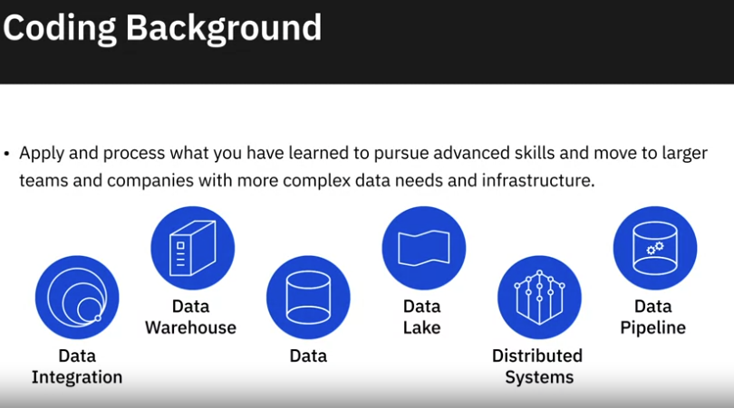

# Module 4: Career Oportunities and Data Engineering in Action
## Career Oportunities and Learning Paths

### Career Oportunities in Data Engineering

#### Reports on Data Engineering Jobs

#### Data Engineering Roles

#### Data Engineering Career Growth Path

### Data Engineering Learning Path

### Viewpoints: What Do Employers Look for in a Data Engineer

### Viewpoints: Advice to Aspiring Data Engineers

- Practice
- Shere knowledge with peers
- Share codes on GitHub
- Write articles on LinkedIn
- Work hard
- Stay curous
-  Create Youtube videos, sreencasts, demos