# Module 1: Extract Transform Load (ETL)

## Working with Python using an IDE
### Demo: Working with an IDE
- IDE=Integrated Develpment Environment
- Cloud IDE:
    - Provided by the IBM Skills Network Team
    - A programming environment for learning
    - Used for writing, running, debugging and executing code directly in a browser without any installation orconfiguratuin on your personal device
- Demo:
    - The Cloud IDE has 2 panes:
        1. An instructional pane
        2. A programming interface: similar to VS code 

## Extract Transform Load (ETL)
- Extract a large amount of data  from different sources and formats
- Transform it into one specific format
- Load it into a database or target file

### The glob module
The glob method of the glob module takes as argument a file pattern and finds and then returns the list off all the files matching the specified pattern

### ETL illustration
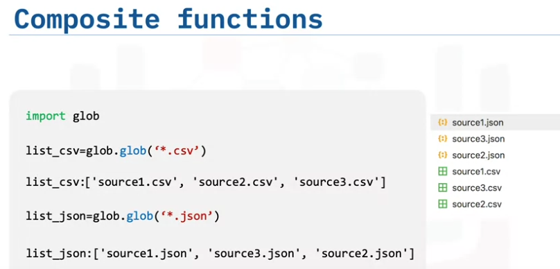

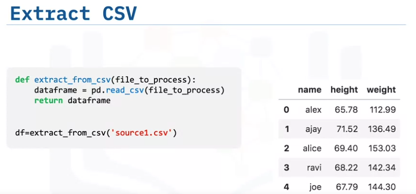
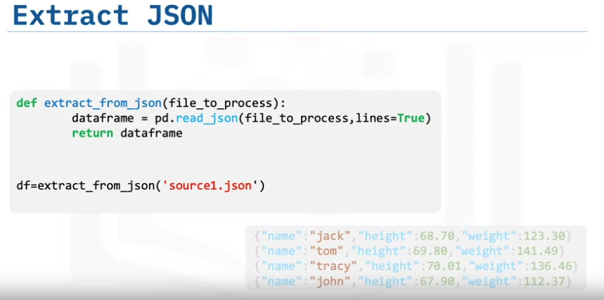
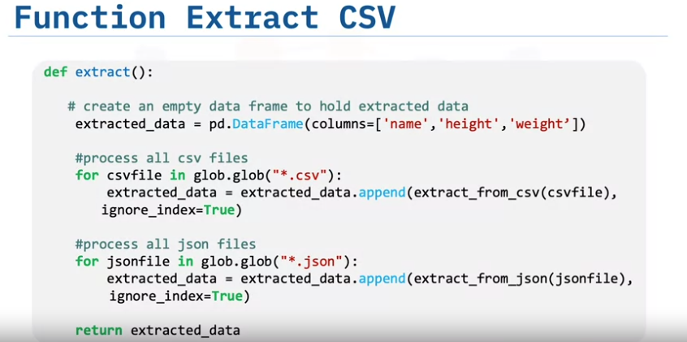

- Without ignore_index: The original index values from the appended DataFrames are retained, which can lead to repeated index values.
- With ignore_index=True: The index is reset to a continuous integer sequence starting from 0, removing any original index values and avoiding repetitions.

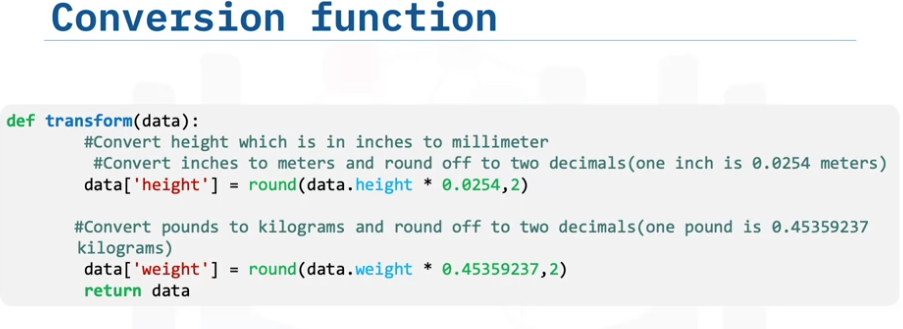

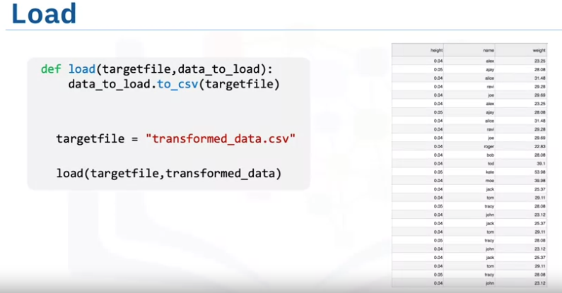

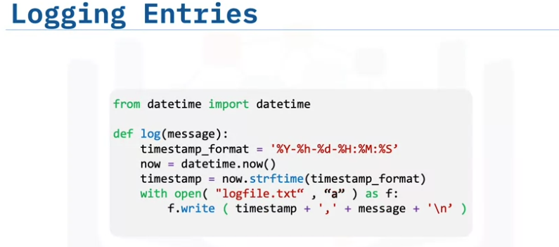

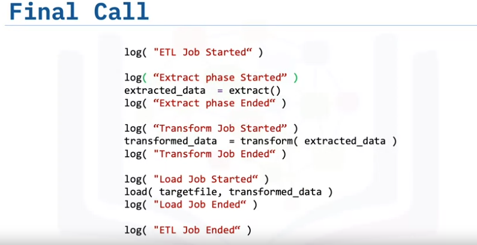

### A simple ETL lab

#### Prerequisites

- Python
- pip
- virtualenv


#### Steps

- Make a directory for the project
```sh
mkdir simple_etl_lab
```

- Switch to the directory
```sh
cd simple_etl_lab
```

- Download the zip file containing all the data to be used
```sh
wget https://cf-courses-data.s3.us.cloud-object-storage.appdomain.cloud/IBMDeveloperSkillsNetwork-PY0221EN-SkillsNetwork/labs/module%206/Lab%20-%20Extract%20Transform%20Load/data/source.zip
```

- Unzip the zip file to excrtact the data files.

```sh
unzip source.zip
```

- Create a virtual environment

```sh
python3 -m venv etl_env
```

- Activate the virtual environment

```sh
source etl_env/bin/activate
```

- Install the necessary python librarie: pandas

```sh
pip install pandas
```

- Create etl_code.py

```sh
touch etl_code.py
```

- Fill etl_code.py 

[ETL code](./practice/simple_etl_lab/etl_code.py)

- Run the code

```sh
python3 etl_code.py
```

- Check the loaded file
- Check the logs file

## Acess data using Webscraping or APIs

### Web Scraping
- Request and Beautifulsoup
- html.parse, html5lib, lxml for ex as parser
- .parent .child nextsibling

- Find all: example

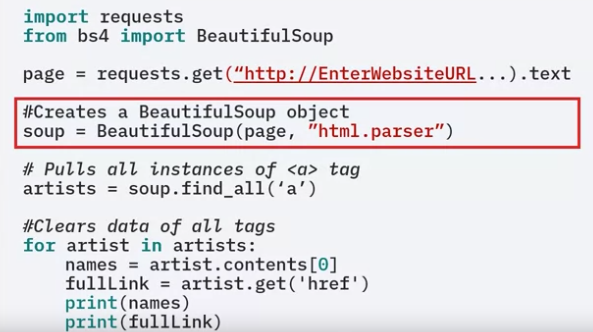

### Rest APIs and HTTP Requests

#### Request library

- One of several libraries including: httplib, urllib, that can work with the HTTP protocol
-Allow to send HTTP requests easily

- Get : get data from a server

 protocole
 base url
 route

 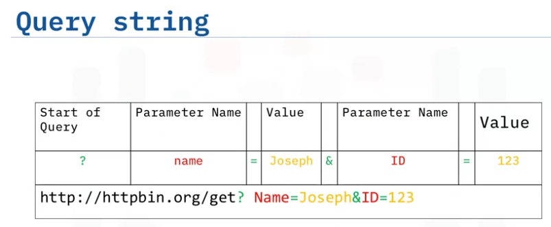

 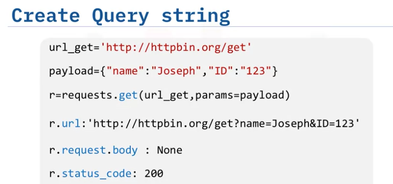

 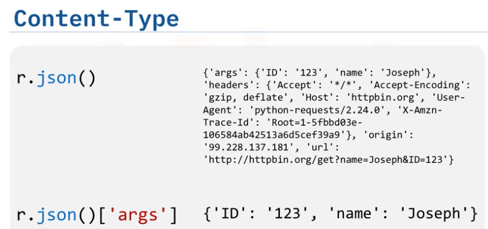

- post: send data to a server

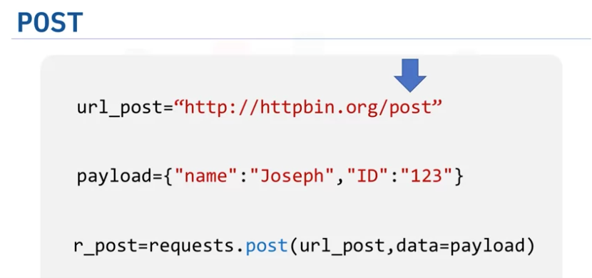

### Web Scraping lab

#### Task

Extract the information of the top 50 movies with the best average rating from the web link shared below.

[Most Highly Ranked Films](https://web.archive.org/web/20230902185655/https://en.everybodywiki.com/100_Most_Highly-Ranked_Films)

The information required is Average Rank, Film, and Year.
You are required to write a Python script webscraping_movies.py that extracts the information and saves it to a CSV file top_50_films.csv. You are also required to save the same information to a SQLite database Movies.db under the table name Top_50.

#### Prerequisites

- Python
- pip
- virtualenv
- SQLite


#### Steps

- Make a directory for the project
```sh
mkdir web_scraping_lab
```

- Switch to the directory
```sh
cd web_scraping_lab
```

- Create a virtual environment

```sh
python3 -m venv web_scraping_env
```

- Activate the virtual environment

```sh
source web_scraping_env/bin/activate
```

- Install the necessary python libraries

```sh
pip install requests bs4 pandas
```

- Create webscraping_movies.py

```sh
touch webscraping_movies.py
```

- Access and inspect the web page to scrape

```sh
https://web.archive.org/web/20230902185655/https://en.everybodywiki.com/100_Most_Highly-Ranked_Films
```
- Fill webscraping_movies.py 

[Movies scraping code](./practice/web_scraping_lab/webscraping_movies.py)

`

- Run the code

```sh
python3 webscraping_movies.py
```

- Check the loaded CSV file, the logsfile, the SQLite db file and the and the output of the programm

## Acessing and Loading databases using Python

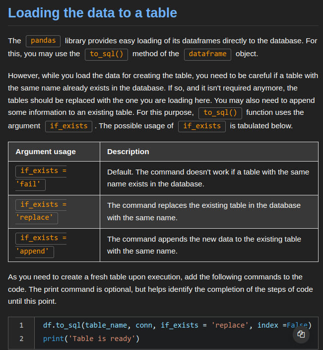


### Lab- Accessing Databases using Python script

#### Task

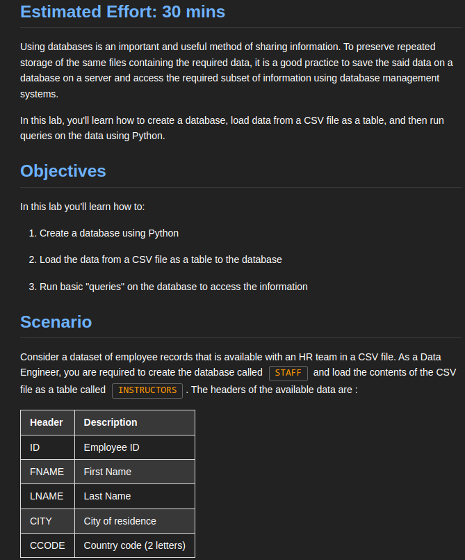

#### Prerequisites

- Python
- pip
- virtualenv
- SQLite


#### Steps

- Make a directory for the project
```sh
mkdir py_access_db_lab
```

- Switch to the directory
```sh
cd py_access_db_lab
```

- Download the data to be used. It is a CSV file

```sh
wget https://cf-courses-data.s3.us.cloud-object-storage.appdomain.cloud/IBMSkillsNetwork-PY0221EN-Coursera/labs/v2/INSTRUCTOR.csv
```

- Create a virtual environment

```sh
python3 -m venv py_access_db_env
```

- Activate the virtual environment

```sh
source py_access_db_env/bin/activate
```

- Install the necessary python libraries

```sh
pip install pandas
```

- Create db_code.py

```sh
touch db_code.py
```

- Fill db_code.py 

[Code](./practice/py_access_db_lab/db_code.py)

- Run the code

```sh
python3 db_code.py
```

- Check the loaded CSV file, the logsfile, the SQLite db file and the and the output of the programm
