# Module 2: Using Relational Databases

## Creating Tables and Loading Data

### Craating Table
#### Steps
- Consider schemas
    - In which database the table is going to be craated?
    - This is the first step in environments with multiple databases
    - Schemas: Many relational databases support schemas, which are logical containers for organizing database objects like tables, views, and procedures

- Collect informations:
    - table name
    - columns names and data types
    - consider wether the colums can contain duplicate and null values
    - Use ERD as reference
    - confirm you have complete set of information to avoid issue later in the process

#### Methods
- Using visual interface or UI tools:
    - Examples: 
        - DB2 on Cloud console
        - MySQL phpMyAdmin
        - PostgreSQL PGAdmin
- Using SQL statemnts: 
    - The CREAETE TABLE statement
    - Include in a script file to automate the process
- Using APIs: programmatically creation and management of tables:
        - Examples:
                - PyMongo for MongoDB

#### DB2 on Cloud console
Steps to follow to create a table using DB2 on cloud console
- Choosing a schema
- Creating a table
- Configuring table columns
### Types of SQL Statements

#### DDL: Data Definition Language

This includes the set of SQL statements used to create, modify or drop database objects such as table.

Common DDL are:

- CREATE
- ALTER
- TRUNCATE
- DROP

#### DML: Data Manipulation Language

A set of statments used to read and update data: CRUD (Create, Read, Update, Delete) operations

There are:
- SELECT
- INSERT
- UPDATE
- DELETE

### ALTER, DROP and TRUNCATE Tables

#### ALTER TABLE

used to
- add or remove columns
- modify the data type of columns
- add or remove keys
- add or remove constraints

#### DROP TABLE

It removes the table from the database

```SQL
DROP TABLE <table>
```

#### TRUNCATE TABLE

```SQL
TRUNCATE TABLE <table>
```

It removes all rows from the table without removing the table itself. The difference with delete is that it reset identity keys.

### Data Movement Utilities

#### Reasons/Scenarios
- Pupulating the database and it's objects, like tables
- Create a copy for develpment and testing
- Create a snapshot of the state of the database for disaster recovery:
    - A snapshot of a database is a read-only, static view of the database at a specific point in time. It captures the state of the database, including all the data and the database schema, as it existed at that moment
- Generate a new table from using data from external source/file
- Add data to one or more existing tables
#### Tools and Utilities

- Backup and restore:
    - Definition:
        - Backup: create a file for the entire database
        - Restore: Create an exact copy of the database from a backup file
    - Backup and restore preserve all obects in the database, including:
        - schemas, tables, views
        - User-defined data types, functions, stored procedures
        - constrainsts, triggers, security settings, relationships between objects, and the data in all the tables
    - Purposes:
        - Backup recovery
        - Develpemnt and testing

- IMport and export:
    - Definition:
        - Import: Reads data from a file and perform insert operations into the target table in a database
        - Exports: Retrieve data from a table in a database and store them in a file
    - Methods:
        - Command line
        - APIs
        - GUI
        - Third party tools
    - File formats:
        - DEL:
            - Use special character delimiters
            - CSV as an example
        - ASC:
            - nondelimited ASCII
            - IMport or load data from applications
            - Generate flat text files with aligned colums
        - PC/IXF:
            - the preferred method for data exchange within the database manager
            -  presents a structured description of a database table containing an external representation of the internal table
        - JSON
    - Examples:
        - DB2 command line:
        - Commands:
            - Import command:
            - 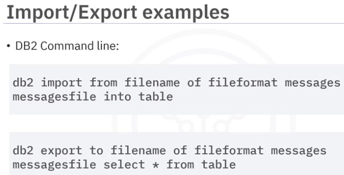
            - Key words:
                - db2 import from
                - of 
                - messages
                - into
            - Arguments:
                - filename
                - fileformat
                - messagesfile
                - table
        - DB2 for cloud web console: export any table as a CSV file
- Load:
    - An alternative to the import utility
    - provided by some DBMS
    - faster than the import utility by directly formatting pages into the database rather than running SQL insert statements like the import process
    -  does not perform referential or table constraint checking
    - may also bypass database logging, which also helps with higher performance. 
    - prefered to the import utilities for large data
    - Example with DB2 command line: 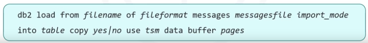

### Data loading
- Insert statement 
    - suits for smal dataset
    - often not pratical for large dataset
- most RDMS provides load:
    - Directly load a large amount of data into a table
    - quick, efficent, scalable
    - source of the data: 
        - data exported from another database in delimited text file
        -  object data output from a bespoke application
    - Example using DB2 Web console: follow 4 steps:
        1. Identity the source of your data
        2. Select the target for the data
        3. Define any configuable aspect of your data
        4. COnfirm

### Hands-on Lab: Create Tables and Load Data in Datasette

## Designing Keys, Indexes and Constraints


### Database Objects and Hierarchy(Including Schemas)

### Primary Keys and Foreign Keys
- Primary Key:
    - Used to uniquely identify every row in a table
        - Possibilities:

            - If an attribute is naturally occuring unique attribute for an entity: it can be set as primary key
            - else a combination of attributes can also be set as primary key
        - Ex: book id in book table
        - Only one primary key per table
        - Ways: PRIMARY KEY(attribute); PRIMARY KEY(attribute1,attribute2,...)
            - During table creation: Use the PRIMARY KEY clause in the CREATE TABLE statement
            - Use the ADD PRIMARY KEY  clause in the ALTER Table statement to set an existing atrribute as primary key

- Foreign key:
    - A key that references a primary key in another table
    - A key that holds information identical to the primary key in another table
    - Ways: FOREIGN KEY(attribute); REFERENCES table2(attribute2)
        - During table creation: 
            - Use CONSTRAINT with FOREIGN KEY
            - You can also set the action to take during update or deletion of a row in the refered table,ie the parent table, using the RULE clause:
                - ON DELETE CASCADE: in case of delete of the parent table, also delete all the corresponding rows in the child/children table(s)
                - ON UPDATE NO ACTION: in case of update on the parent table, do not take any action
        - During table modification: Use the ADD FOREIGN KEY clause in the ALTER Table statement to set an existing atrribute as foreign key

### Overview of Indexes
- Inroduction example: A library with an extensive collectio of books. When you want to find a specific book in the collection
    - Mothod1/stupid approach: Check each book until you find the book you need
        - Limits: Time consuming, inefficient
    - Method2/A better approach: Catalog; 
        - AN index listing all the books in the library 
        - List each book by it's category, author, etc
        - Helps locate the books very quickly: Navigate through the indexe to finde the book you need
        - Indexing a table in a table in a database works similary

- In a database, an index
    - is data structure
    - allows to find quickly rows basing on a specific criteria
    - Ex: In a customer table, create an index on custer name colum allows to find custeomers quickly based on their names
    - a pointer is matched to your data during insertion, and during retrieval, that pointer is used to locate your data quickly
    - Index creaion:
        - Primary key automatically creates an index on the concerned key
        - You can use CREATE INDEX clause during table creation, buy specify the index name and the concerned table and colum
        - Avantages: 
            - Improve SELECT performance
            - Reduce need to sort data
            - Guaranted uniqueness of rows: if you use the UNIQUE clause during the creation of the index
        - Disavantages:
            - Use a disk space
            - Decrease performance op insert, update and delete queries


### Normalization

- Duplicate/redundant data can cause inconsistencies and then extra work since you will have to update the same values many times during update
- Normalization is the process of organizing your data to reduce redundant data, often by dividing larger table into multiple related tables. 
- Advantages:
    - Speed up transactions since you performe updates, additions and deletions only once on a normalized database
    - improves data integrity since it reduces the chance of having to make the same changes in many places
- Normalize each table until you reach the normal form level
- Results in creating more tables
- Once all tables are normalized you will have a normalized database
- there are several forms of normalization
- The most important data engineers should be familar with are:
    - the first normal form:
        - aka 1NF
        - Rules/Requirements:
            - Each row must be unique ie no duplicate row in the table
            - Each cell must contain only a single/atomic value, rather than a list:
                - Replace any row with a cell containing a list, by multiple rows, each one with a single value of that list for the corresponding column
        - Example:
            - Table before 1NF: 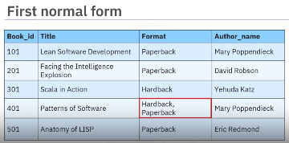
            - Table after 1NF: 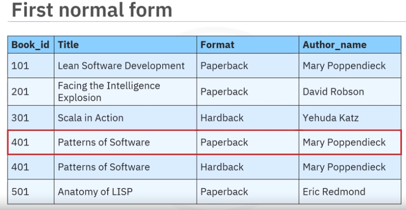
    - the second normal form:
        - aka 2NF
        - Rules/Requirements:
            - the database must already be in the first normal form
            - Removing subsets of data that apply to multiple rows and placing them in separate tables(multiple rows dedicated to the same instance of data).
        - Example:
            - Table before 2NF: 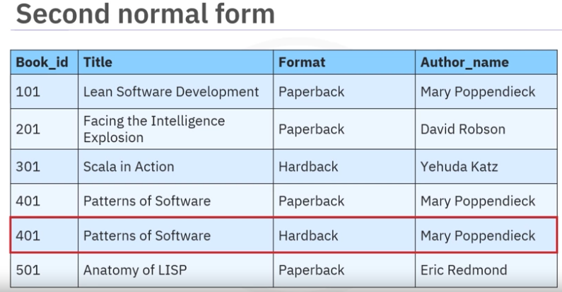
            - Tables after 2NF: 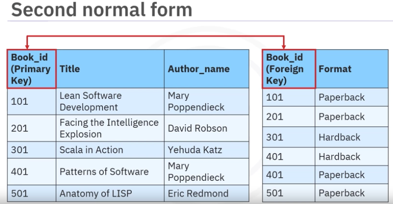
    - the third normal form:
        - aka 3NF
        - Rules/Requirements:
            - the database must already be in the first and second normal form
            - Eliminate columns that do not depend on the key
        - Example:
            - Table before 3NF: 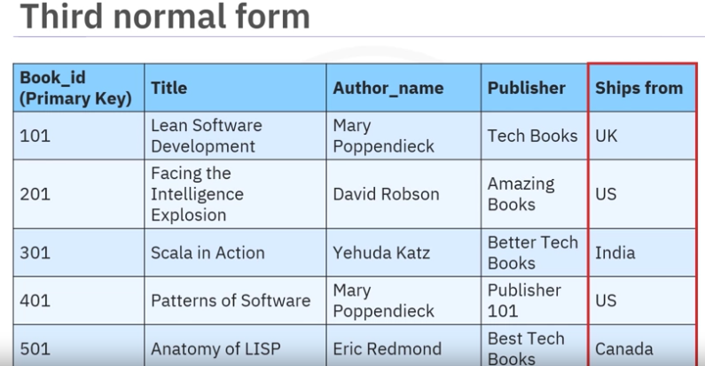
            - Tables after 3NF: 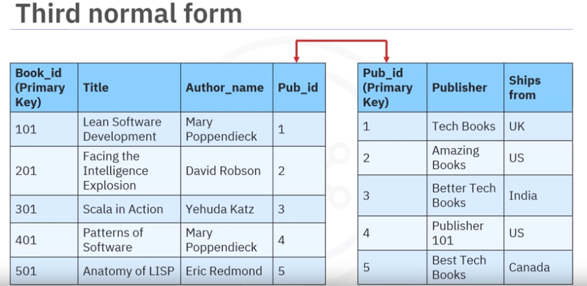
            - Explanation:
                - Isue with the publisher and ship from columns
                - Each publisher ships books from warehouses in their own location
                - So the ship from colun depends on the publisher, not on the book id, which is the key
                - So create an additional table for the publisher and ship from columns
                     
- There are also higher normal forms such as 
    - Boyce-Codd normal form aka BCNF, which is an extension to the third normal form
    - fourth normal form
    - fifth normal form
- In transactional systems, OLTP, where data is both read and written frequently, you typically normalize the data to 3NF
- In analytical OLAP systems, where users primarily read data
    - databases prioritize read performance over write integrity
    - Hence, the data may have undergone some denormalization to a lower normal form before being loaded into the analytical system, such as a data warehouse
    -In data warehousing, data, engineers focus on performance, which can benefit from having fewer tables to process.


### Relational Model Constrainst- Advanced
- Entity integrity constraint:
    - Primary key
    - A unique value that identifies each row in a table
    - No attribute that is a part of , ie that participates to a primary key should have a null value: because meny rows may have null values for that attribute
    - No two rows can have a duplicate primary key value.
    - Every row must have a primary key value.
    - No primary key field can be null.

- Referencial integrity constrainst: 
    - Ensures that relationships between tables are maintained accurately, using pks and fks
    - EX: For a book to exist it has to be written by at least one author
- Semantic integrety constrainst: 
    - enforces the correctness of the data in a table
    - Ex: 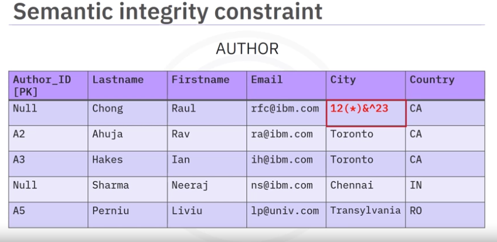
- Domain constraint:
    - checks for valid values given for an attribute
    - Ex: 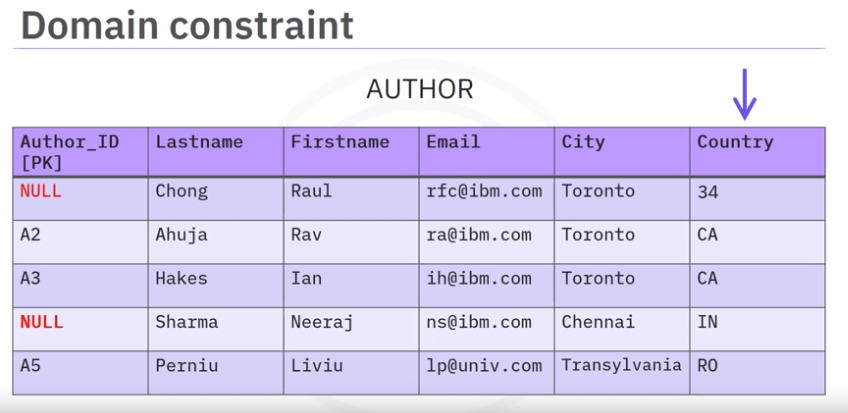
- Null constrainst: 
    - Attribute values should not be null
    - Ex: 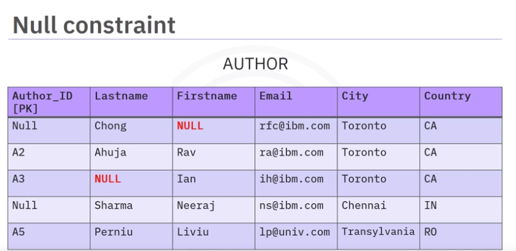
- Check constraint: 
    - Enforses domain integrity by limiting the values accepted by an attribute
    - Ex: Year must be less than or equql to the current year