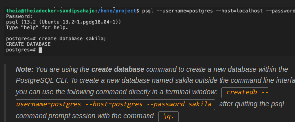
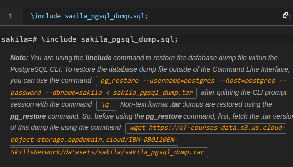
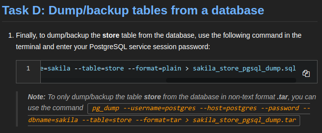
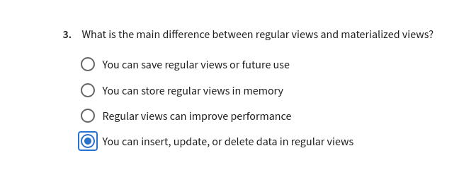

# Module3: MySQL and PostgreSQL

## MySQL

### Getting Started with MySQL

- MariaDB is a fork of MySQL by some of the original developers of MySQL
- Deployment options
    - Download and install options:
        - Community edition
        - Commercial editions
    - Cloud deployment:
        - Virtual machine images and containers
        - Managed services:
            - IBM Cloud
            - Amazone RDS
            - Azure Database
            - Google Cloud SQL
                    
- Pratical applications of MySQL:
    - Large-scale websites:
        - Faebook
        - Youtube
        - Twiter
    - E- commerce platforms:
        - Shopify
        - Magento
        - WooCommerce
    - Small and medium-sized businesses
- Popular tools:
    - MySQL command line interface(MySQL CLI): 
        - Helps interact wih MySQL server and data trough commnd:
            - either interectively
            - or from a specific text file
        - Ex: The show databases command
        - Usage:
            - database administrators: for 
                - direct server interaction
                - permissions management
                - and database monitoring
            - Developers:for streamlined tasks like 
                - database creation, 
                - database modification
                - scripting
            - System administrators: for 
                - server configuration
                - performance tuning, and troubleshooting
                - ensuring efficient database management at the system level

    - mysqladmin command line program for RDBMS administration
    - Specialized MySQL utilities for specific tasks:
        - MySQL Workbench desktop application for:
            - Windows
            - Linux
            - MacOS
    - Third party web interface: phpMyAdmin

### Creating MySQL Databases and Tables
- CLI

```sql
CREATE DATABASE db_name;
USE db_name
CREATE TABLE table_name(col1 type1, col2 type2, ...);
DESCRIBE table_name
```
- GUI: phpmyadmin for ex
- APIs


### Populating MySQL Databases and Tables

- Backup using mysqldump command
```bash
mysqldump -u root db_name > backup_file.sql
```
This command generate a sql file containing all the SQL commands needed to re-create exactly the specified database with all it's content

-u root specifies the user

db_name is the name of the database to backup

backup_file.sql is the resulting SQL file

If you want to backup specific tables, list their names after the database name

- Restore backup using mysl command

```bash
mysql -u root db_name < backup_file.sql
```
db_name is the destination database

- Restore using source command

If already at the mysql command prompt
```bash
source backup_file.sql
```
This method can also be used to execute SQL scripts from file

- Backup and restore using phpMyAdmin
- Import data files 
    - using load from mysql cli: suitable for large data

```bash
load data infile 'file_name.csv' into table table_name
```
    - Using mysqlimport

```bash
mysqlimport table_name 'file_name.csv' 
```
    - Using phpMyAdmin
- Export data to files using phpMyAdmin

SHOW FULL TABLES WHERE table_type = 'BASE TABLE';
\q

## PostgreSQL

### Getting started with PostgreSQL

- Suitable for:
    - OLTP
    - data analytics
    - geographic informations systems

- Deployment options:
    - Local installation: MacOs. Linux, Windows
    - Virtualization and containers
    - Cloud deployments:
        - Amazone RDS
        - Google Cloud SQL
        - Microsoft Azure
        - IBM Cloud database
        - EntrepriseDB Cloud
- Connectivity tools:
    - psql: a CLI
    - pgadmin: a GUI
    - Commercial options: Navicat and Dbeaver
    - Managed database services: Amazone RDS for PostreSQL, for ex

### Creating Databases and Loading Data in PostreSQL

- Using CREATE TABLE statement
```sql
CREATE DATABASE db_name;
\connect db_name;
CREATE TABLE table_name(col1 type1, col2 type2, ...) ;
\d table_name; --Describe a table
```

- Restore backup using psql command

```bash
psql db_name < backup_file.sql
```

This command generate a sql file containing all the SQL commands needed to re-create exactly the specified database with all it's content

- Use pgAdmin to create databases
- Use pgAdmin to restore backup
- Use pgAdmin to create table
- Use pgAdmin to load or export 
-  use pgAdmin to load or export tables: use import/export   
- Backup databases using pg_dump

```bash
pg_dump db_name > backup_file.sql
```
restore backup from postgres prompt
\include sakila_pgsql_dump.sql;  \i

pg_restore to resore outside the postgres prompt








### Views

- Present data from one or more tables, or other views
- Enables interactions with data as tables
- Restrics access to sensitive data
- Simplifies data retrieval
- Reduces access to underlying tables
- For ex:
    - create a view from:
        - First table containing firstanme and lastname
        - Second table containing emails:
    - users can then easily access these data :
        - without needing to know that it is stored in 2 different tables
        - without having access to sensitive informations like employees salaries
- Can be created using:
    - pgAdmin
- Supports materialized views:
    - behaves differently to regular views
    - resultset saved for future use, when materialized view created for th first time
    - cannot insert, update or delete
    - can improve performance: the resultset often stored in memory

    


