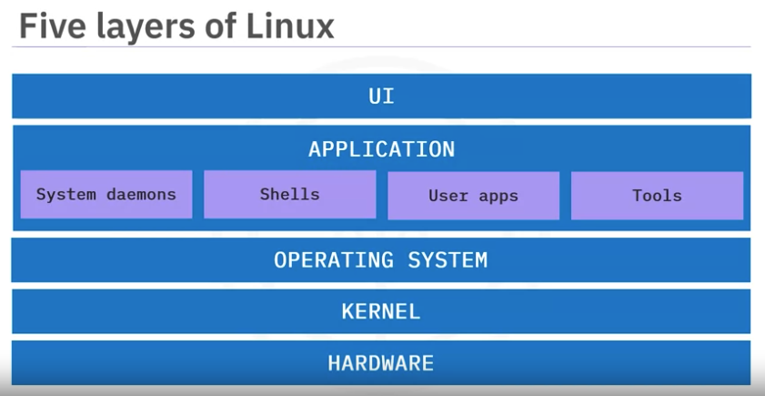
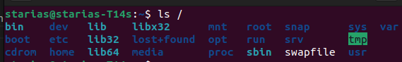
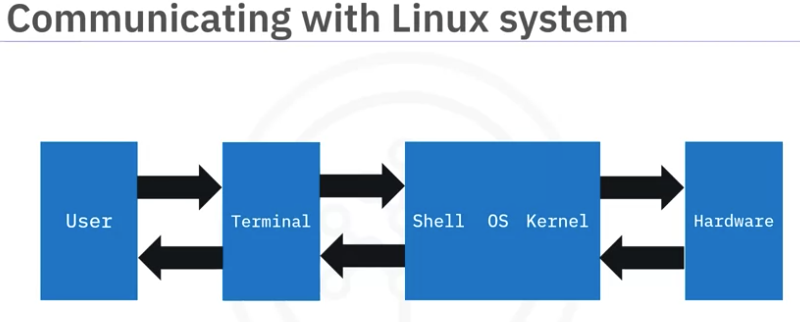

# Module 1: Introduction to Linux

## Introducing Linux and Unix

## Linux Distributions

### OS
- a software that:
    - manages hardware(CPU, RAM, storage, screen, keybord, mouse, etc)
    - Allows interactions with hardware

### Unix

- a familly of Operating Systems(OSs)
- Popular Unix-based OSs:
    - Oracle Salaris (and Open Salaris)
    - FreeBSD
    - HP-UX
    - IBM AIX
    - Apple macOS
- Unix beginnings
    - 1960s:
        - the Original Unix OS created at AT&T Bell Labs
        - made for a specific hardware system, the PDP-7 computer
    - 1970s:
        - Unix OS rewritten in C
        - this made it portable to many hardware systems
    - In the late 1970s:
        - Berkley Software Distribution (or BSD) developed by  UC Berkley
        - BSD=Unix with  additional software and capabilities
    - Later: macOS derived from BSD

### Linux
- a family of Unix-like OSs
- an effort to create a free and open source version of the Unix OS
- Key features:
    - free and open source
    - secure: With so many eyes on the source code, Linux has become the most secure OS over the years
    - multi-user: multiple users can access the system simultaneously
    - supports multitasking: running multiple jobs and applications at the same time
    - portable: can run on many diffrent types of devices nd hardware platforms: desktops, servers, appliances

- Linux beginnings
    - 1980s:
        - GNU developed at MIT
        - GNU stands for GNU's not Unix
        - a free an open source version of the existing Unix sytem tools
    - 1991s:
        - a free and open source version of the Unix kernel, called Linux
        - by Linus Torvals
        - kernel: the core component of an OS that enable components to communicate with the hardware
    - 1992s:
        - Linux OS born
        - Linux OS= GNU+ Linux Kernel
        - kernel: the core component of an OS that enable components to communicate with the hardware
    - 1996:  a computer scientist named Larry Ewing created ”Tux” the penguin, which was later adopted by Linus Torvalds as the official Linux mascot

- Today:
    - the BSD based macOS runs on millions of devices
    - Billions of Linux instances run on servers, serving the modern web
    - Modern Linux OSs such as Ubuntu, are gaining popularity for PCs
- Use cases:
    - Android: Linux is the OS kernel of Android OS
    - Supercomputers for HPC
    - Data centerds and cloud services
    - PCs

## Linux Distributions
- A linux distribution:
    - a specific variant of Linux OS
    - also referred as distro
    - must use Linux kernel as OS kernel
    - hundreds of Linux distros available today, each tailored for a specific audience or task
- Linux distro differences:
    - unit set of utilities: commands and applications that come with the distro
    - GUI for interacting with the OS
    - Sheel commands
    - Support types:
        - Community vs entreprise
        - A Long Term Support (LTS) version:
            - a version of a Linux distribution (or other software) that is designated for extended support
            - intended to be stable and reliable over a longer period of time.
- Linux Distros:
    - Debian:
        - first version in 1993 named, 0.01
        - first official and stable version in 1996, named 1.1
        - stable, reliable, open source
        - supports many computer architectures (or types of hardware)
        - the largest community-run distro currently available

    - Ubuntu:
        - first version in 2004, named 4.10
        - Debian-based ie bult on top on Debian
        - Developed and managed by Canonical
        - Has three editions:
            - Ubuntu Desktop
            - Ubuntu Server
            - Ubuntu Core for IoTs

    - Red Hat Linux:
        - supports many architectures
        - actively developed, with a large and growing community
        - sponsored by Red Hat, an IBM subsidiary
        - stable, reliable, secure
    - SUSE Entreprise:
        - aka SLE (SUSE Linux Entrprise)
        - Available in two editions:
            - Servers(SLES)
            - Desktop (SLED)
        - Supports many architectures: ARM for Rasberry Pi for ex
        - Uses SUSE package Hub which enables users to install packages that aren’t officially part of SLE
        - maintained by the small German open-source software company, SUSE
    - Arche Linux:
        - Do-it-yourself approach: allows users to  customize every part of their system
        - Highly configurable
        - Requires a strong understanding of Linux and system tools
        - up to date software

## Overview of Linux Architecture

The Linux architecture has 5 layers:
- UI:
    - allows users to interact with the system using a keyboard or a mouse
- Applications: Any software that allows you to permorm a task. It includes
    - system tools such as compilers
    - programming languages
    - shells
    - user apps: browsers, text editors, games, etc
    
- OS: controls the jobs that are vital for system health and stability:
    - Assign software to users
    - Detect errors and prevent failures
    - perform file management tasks
- Kernel: the core component of the OS; interacts with the hardware. Key jobs:
    - memory management
    - process management
    - device drivers
    - security
- Hardware: include allthe  physicall or electronic devices in the computer.
    - CPU
    - RAM
    - Storage
    - screnn
    - USB devices such as keyboard, mouse, USB drive

## Linux filesystem
- collection of files in your machines. Include:
    - Files needed to run the machine and applications
    - your own files containing your work
- Begin at root directory, denoted by /:
- a tree-like structure
- the filesystem assigns appropriate access rights to the directories and files
- The root directory:
    - The beginning of Linux filesystem
    - Contains many other directories and files: 
    -Some key directories:
        - /bin: 
            - contains binary files
            - binary files contain code your machine read to run programs adn execute commands
        - /usr: contains users programms
        - /home:
            - Your personal working directory
            - Contains your own files
        - /boot: Contains system boot files
        - /media: files related to temporary media that are conected to the system, such as:
            - CD
            - USB drives

## Linux Terminal Overview

- Linux shell:
    - An OS-level application that interprets commands
    - In the early versions of Unix an Linux, it was the first way to interact with the OS
    - Can be used to:
        - Move and copy files
        - Write to and read from files
        - Extract and filter data
        - Search for data
    - Shells versions:
        - There are many shell versions, but the base functionality of most is the same. They include
        - Bash
        - Zsh

- Terminal: 
    - an application used to interact with the shell
    - an application, a UI
    - used to enter commands and receive output from them
    - Ex: 
        - python hellp.py
        - You use the terminal to enter the command
        - the shell interprets the command and runs it
        - the programms prints hello world
    - Communicating with the Linux system: 

- The Linux terminal:
    - The command line is: the area where you enter commands
    - Command prompt: 
        - the cursor or vertical line
        - Indicates where the textyou tap will be displayed
    - The current working directory: 
        - The file location where the shell will look for any command that you specify to run
        - Some termials displays not the entire path but just the directory at the last lavel
- Paths in the Linux filesystem:
    - a/b
    - Special paths:
        - Home directory: ~
        - Root directory: /
        - Parent of current directory: ..
        - Current directory: .
- Changing the current directory: cd

## Browsing directories with the Linux terminal
- pwd: prints the path name to the present working directory
- ls:  lists the contents of a directory

## Linux Terminal Tips - Tab completion, command history
- Tab completion to autocomplete commands
- Up and down arrows to browse commands history
    
## Hands-on Lab: Getting Started with the Linux Terminal
Notice that one of the files in the /bin directory is called "ls". Indeed, when you enter the ls command, Linux searches for and runs the ls command by executing the binary file /bin/ls.

## Creating and Editing Text files
- Popular editors:
    - 2 categories:
        - Command line text editors:
            - GNU nano: a small and friendly modeless text editor
            - vi: a traditional command-line editor originally created for Unix
            - vim: a powerful mode-based command line-editor based on vi
        - GUI text editors:
            - gedit: the default editor from the GNOME environment
            - emacs: 
                - another text editor that is one of the oldest free, open source projects still under development
                - can be used in GUI mode or within a command line

## Hands-on Lab: Installing, Updating, and Working with Text Editors

super-user do
Use the sudo command to enable access to "super-user" system administration tools
Use the apt system administration command to update and install two popular packages for text editing: nano and Vim

In short, running apt with the update option ensures all of your package dependencies are up-to-date and correctly specified prior to making any changes to your system's packages.

sudo apt upgrade nano
sudo apt install vim

nano 

ctrl x to exit after editin

Vim has two basic modes: Insert mode, where you enter text, and Command mode, where you do everything else

:help  get help from vim
:quit quit vim

create and edit
vim hello_world_2.txt
Press i to enter insertion mode
Then type everu=ything you want

When you're done typing text in the buffer, press the Escape key, Esc, to exit the Insert mode. This brings you to Command mode.
:w This writes the contents of the text buffer to your text file.

Finally, you can exit your Vim session by entering :q.
vim done.txt
edit echo ...
exit
run bash done.txt

## Installing Software and Updates

Both software installation and software updates files for Linux operating systems are distributed in files known as packages
- packages :
    - are archive files  containing the requirements for:
        - either installing a new software
        - or updating an existing software
- package managers 
    - are used to manage the download and installation of packages
    - are available for different Linux distros
    - Can be GUI-based or command-line tools
- Deb and RPM packages:
    - used by package managers in Linux OS
    - are distinck files types containing software or updates for different Linux OSs
    - .deb files:
        - Used for Debian-based distros such as:
            - Debian
            - Ubuntu
            - Linux Mint

        - stands for Debian
    
    - .rpm files:
        - Used for Red Hat-based distros such as:
            - CentOS/RHEL
            - Fedora
            - OpenSUSE

        - stands for Red Hat Package Manager
        - deb and rpm formats are equivalent:
            - the content of the file can be used for other types Linux OSs
            - If you find that a package that you want to use is only available in the other format you can convert it using the alien tool:
                - RPM to deb:
                    - alien <package.rpm>
                - deb to RPM:
                    - alien -r <package.deb>
- Benefits of package managers:
    - Automatically resolve dependencies
    - Notify you wan updates are available
    - GUI-based package managers:
        - can automatically check for updates
        - automatic or manual updates installation
    - GUI-based Linux distro package managers include :
        
        - Update Manager:
            - A GUI-based tool for updating deb-based Linux distros
            - automatically checks for updates daily
            - supports manually checks for updates
            - notifies if updates are available. You can then:
                - select the updates you want
                - click on Install Update
                - etc
                - the updates will be installed in background for you
        - Packagekit:
            - A GUI-based tool for updating RPM-based Linux distros
            - automatically checks for updates daily
            - supports manually checks for updates
            - notifies if updates are available
    - apt:
        - a command line tool for updating deb-based Linux systems
        - sudo apt update:
            - Used to find available updates
            - the output of this command:
                - lists each available package
                - builds a dependency tree
                - lets you know how many packages can be upgraded
        - sudo apt upgrade: upgrade all packages
        - sudo apt install <package name>: install a specific package
    - yum: 
        - a command lin tool for updating RPM-based Linux systems
        - sudo yam update:
            - Used to find available updates
            - update all packages
            
        - sudo yum install <package name>: install a specific package

- Other software package managers: pip or conda: for managing python environments

## Module 1 Cheat Sheet - Introduction to Linux

man ls

    
